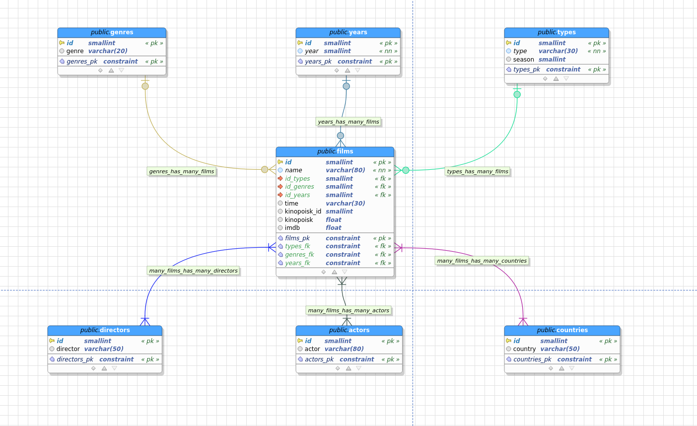
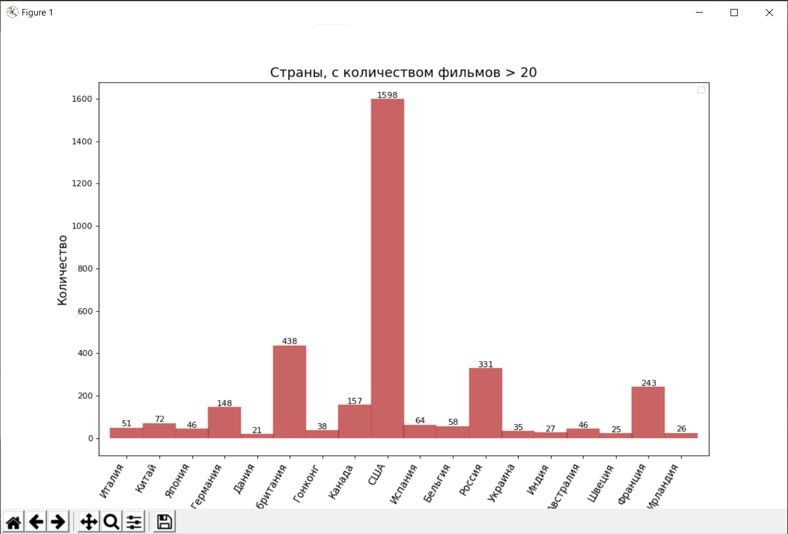

# VideoArchive
  
#### Основной функционал программы на текущий момент:  
1. Программа переименовывает видеофайлы в соответствии с определенными правилами.
2. Копирует фильмы и сериалы с одного диска на два других в соответствии с жанрами и типами.
3. Парсит Кинопоиск.
4. Делает записи в Films.xlsx на **arch_disk** и в doc-файлах на дисках назначения. 
5. Делает запись в базу данных **Postgresql**.
6. Рисует графики по данным запросов из базы.  

***
#### Основные моменты:
 - Парсинг данных о фильме или сериале произодится через Selenium на сайте Кинопоиск.  
 - Файлы берутся из каталога **arc_disk:\New** и **arc_disk\Convert** 
 - Необходимый формат имени файла с фильмом **Жанр_год_Название.mkv**
 - В **arc_disk\Convert** могут лежать конвертированные файлы фильмов из **arc_disk\New**
 (конвертированы для уменьшения размера или изменения расширения).
 - Необходимый формат имени папки с сериалом **IDКинопоиска_Название** или **IDКинопоиска_Название (.. сезон)**
 - Сезоны и серии сериалов переименовываются в **Season...\Episode...**
 - Вычисляются номера сезонов и эпизодов.
 - При переименовании серий 13 номер пропускается(13 серия = Episode 14 и так далее).
 - Происходит поиск уже записанных на диски сезонов сериала: вычисляется по размерам и 
 наименованиям файлов есть ли этот сезон или это новый.
 - Поиск номера сезона производится несколькими путями: через имена каталогов, через имена файлов, 
 либо номер сезона ставится следующий за последним уже имеющимся на диске. 
 - От имени файла с фильмом отрезается жанр и дата. Остается только название. Название и год 
 необходимо указывать, как на Кинопоиске для успешного парсинга данных.
 - Выполняется проверка на наличие на диске записываемых файлов. Если файл уже записан, то он пропускается.
 - При копировании файла делается запись уже имеющихся данных из названия файлов в общую базу Films.xlsx => 
  _________________________________________________________________________________________________________________
    Name | Type | Season | Genre | Year |
 - Films.xlsx заполняется полностью после парсинга Кинопоиска и полная структура имеет следующий вид:
 
 _________________________________________________________________________________________________________________  
    | Name | Type | Season | Genre | Year | Kinopoisk ID | IMDB | Kinopoisk | Country | Time | Director | Actors | ID |  
     ------|------+--------+-------+------+--------------+------+-----------+---------+------+----------+-------------  
    |      |      |        |       |      |              |      |           |         |      |          |        |    |  

 - Коннект к Postgresql производятся по данным из файла dbauth.txt, который должен лежать в корне
 проекта.
 - Запись в БД происходит через хранимую процедуру.

 - Структура БД в Postgresql:  
 
 
***

#### Копирование на диск **chief_disk**:
 - Любой размер файла.
 - Сериалы и фильмы записываются в корень диска. 
 
#### Копирование на диск **serv_disk**:
 - Фильмы копируются по пути **serv_disk\Фильмы\Жанр\\**
 - Сериалы копируются по пути **serv_disk%\Сериалы\Название\Сезон ..\\**
 - Размер файла должен не превышать 9Gb. Если больше, то файл пропускается.
 - Сначала копируются сконвертированные файлы из каталога **arc_disk\Convert**. В этом случае
 этот файл из **arc_disk\New** уже не обрабатывается.
 - В каталогах **serv_disk\Фильмы\Жанр\** создается doc-файл с записями фильмов и годов в этом каталоге.

***
#### Пример построения графика по данным из БД:

***

#### Основные модули:
 - **main_class.py** - основной модуль программы. Содержит классы для обработки фильмов и сериалов.
 - **kinopoisk_parser.py** - модуль для работы с сайтом Кинопоиска и извлечения оттуда данных.
 - **db.py** - модуль для работы с Postgresql.
 - **plots.py** - модуль для постороения графиков
 - **database** содержит: 
     - копию Films.xlsx 
     - бэкап базы Postgesql
     - графическую визуализацию структуры БД Postgresql
     - файл с кодом хранимой процедуры для записи в БД и текстами некотрых других запросов 
     для работы с БД
 - **Manuals** - самописные мануалы для работы с Git и SQL.
 - **Old** - папка с ранними версиями main_class.py
 - **Scripts** - одноразовые скрипты
    - **add_data_in_xlsx.py** - первая версия скрипта для заполнения Films.xlsx. Имеет проблемы при большом количестве запросов.
    - **convertation.py** -  получение длительности файла, аудио и видео битрейта
    - **selenium_fill_the_xlsx.py** - рабочий скрипт для заполнения Films.xlsx всеми данными через Selenium браузер с любым количеством запросов.
    - **separate_season.py** - для правки Films.xlsx ("Сезон 1-3" => в три записи с "Сезон 1", "Сезон 2", "Сезон 3")
    - **add_data_in_db.py** - перенос всех данных из Films.xlsx в БД Postgresql
    - **add_seasons_date.py** - поиск дат выхода сезонов на Кинопосик и заполнение таблицы ими
    - **mailfromphone.py** - не относится к текущему проекту. Парсит большой xlsx-справочник и получает почтовые адреса определенных групп сотрудников.
    
 